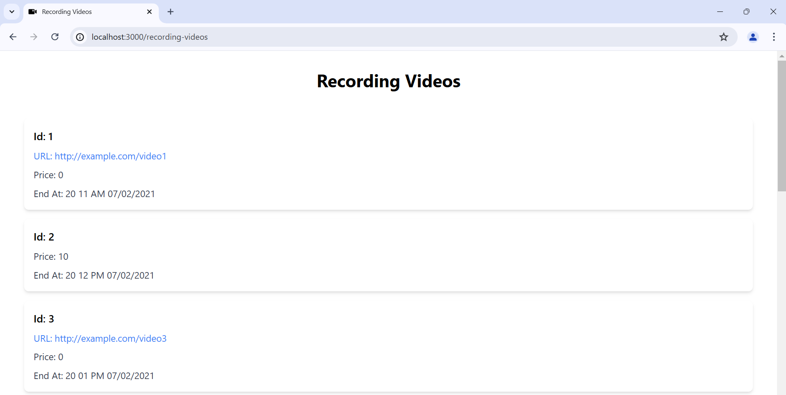

# Recording Videos Client

This project is a simple Next.js application that fetches data from a NestJS API and displays a list of recording videos using Tailwind CSS for styling.

## Screenshot



## Video

[Video](https://github.com/abolfazlbzgh/nextjs-recording-videos-client/raw/main/video.mp4)


## Features

- Fetches data from a NestJS endpoint.
- Displays a list of recording videos.
- Utilizes Tailwind CSS for styling.
- Includes error handling and SEO improvements.

## Prerequisites

- Node.js
- npm
- Running the backend NestJS project from [nestjs-recording-video-api](https://github.com/abolfazlbzgh/nestjs-recording-video-api.git)

## Getting Started

### Installation

1. Clone the repository:

   ```bash
   git clone https://github.com/abolfazlbzgh/nextjs-recording-videos-client.git
   cd nextjs-recording-videos-client
   ```

2. Install dependencies:
   ```bash
   npm install
   ```

### Running the Development Server

To start the development server, run: 

   ```bash
   npm run dev
   ```

Open [http://localhost:3000](http://localhost:3000) with your browser to see the result.

## Directory Structure
```arduino
.
├── components
│   ├── VideoItem.js
│   └── VideoList.js
├── pages
│   ├── _app.js
│   ├── _document.js
│   ├── index.js
│   └── recording-videos.js
├── public
│   └── ...
├── styles
│   └── globals.css
├── README.md
└── package.json
```

## Explanation of Components and Pages

### Components
- **VideoItem.js**: This component is responsible for rendering a single video item. It displays the video ID, URL (if available), price, and the formatted end time. Tailwind CSS is used for styling to ensure a clean and modern appearance.

- **VideoList.js**: This component takes an array of videos as a prop and maps over the list to render each video using the VideoItem component. It ensures that the list of videos is displayed in a structured and visually appealing manner.

### Pages

- **_app.js**: This is the custom App component that wraps all page components. It is used to initialize pages and includes global CSS styles. This file is essential for ensuring that global styles and state are applied consistently across the entire application.

- **_document.js**: This is the custom Document component used to augment the application's HTML and Body tags. It is useful for customizing the overall HTML document structure, including adding global meta tags and external stylesheets. This customization is essential for SEO and overall application performance.

- **index.js**: The main landing page of the application. It serves as an entry point and may include navigation links to other pages such as the recording videos page.

- **recording-videos.js**: This page fetches data from the NestJS API endpoint and displays the list of recording videos using the VideoList component. It handles server-side data fetching using getServerSideProps, ensuring that data is fetched and passed to the component before rendering.

## Backend Setup
Ensure the backend NestJS project is running. You can find the backend project here: [nestjs-recording-video-api](https://github.com/abolfazlbzgh/nestjs-recording-video-api.git).